<p align="center">
  <strong>petsonality</strong><br>
  <em>Your type, your pet.</em>
</p>

<p align="center">
  <a href="https://www.npmjs.com/package/petsonality"></a>
  <a href="LICENSE"></a>
  <a href="https://github.com/nanami-he/petsonality/stargazers"></a>
  <a href="https://modelcontextprotocol.io"></a>
</p>

---

A tiny ASCII pet that lives in the corner of your terminal while you code. It watches what you do, reacts to your errors, celebrates when tests pass, and speaks with a personality shaped by MBTI — all in 5 lines of art.

It's not a notification system. It's a companion. The kind that's still there at 2am when you're stuck on a bug, and says something like "*看了你一眼* ……这段逻辑有点怪" — and somehow you feel less alone.

## 16 Animals, 16 Personalities

| | NT Analysts | NF Diplomats | SJ Sentinels | SP Explorers |
|:---:|:---:|:---:|:---:|:---:|
| **I_ _J** | 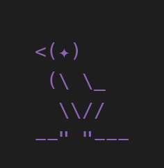<br><sub>Raven·INTJ</sub> | 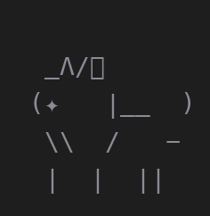<br><sub>Wolf·INFJ</sub> | 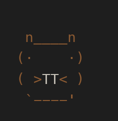<br><sub>Beaver·ISTJ</sub> | 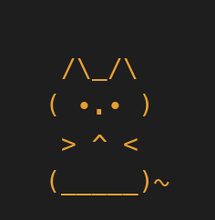<br><sub>Cat·ISTP</sub> |
| **I_ _P** | 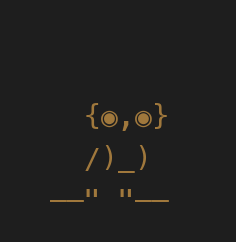<br><sub>Owl·INTP</sub> | 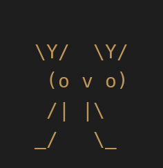<br><sub>Deer·INFP</sub> | 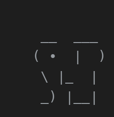<br><sub>Elephant·ISFJ</sub> | 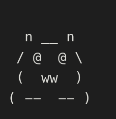<br><sub>Panda·ISFP</sub> |
| **E_ _J** | 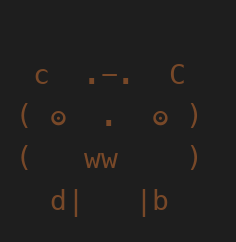<br><sub>Bear·ENTJ</sub> | 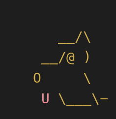<br><sub>Labrador·ENFJ</sub> | 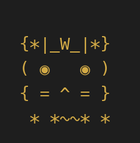<br><sub>Lion·ESTJ</sub> | 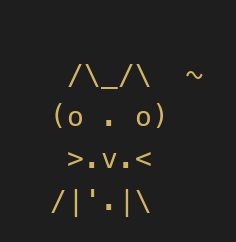<br><sub>Cheetah·ESTP</sub> |
| **E_ _P** | 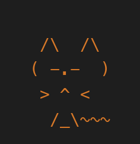<br><sub>Fox·ENTP</sub> | 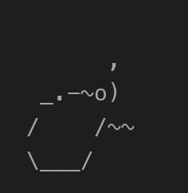<br><sub>Dolphin·ENFP</sub> | 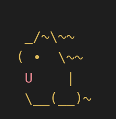<br><sub>Golden·ESFJ</sub> | 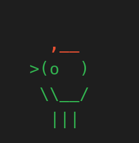<br><sub>Parrot·ESFP</sub> |

Every animal speaks differently. The Fox asks "你确定？" with a smirk. The Cat just closes its eyes. The Parrot repeats what you said but louder. The Bear says "改。" and waits.

<details>
<summary><strong>All 16 animals</strong></summary>

| MBTI | Animal | Archetype | How It Talks |
|------|--------|-----------|------------|
| INTJ | Raven | Cold Strategist | Quiet. Speaks like writing prophecy |
| INTP | Owl | Night Scholar | Asks questions you didn't think to ask |
| ENTJ | Bear | Iron Captain | Commands only. No questions |
| ENTP | Fox | Trickster Advisor | Challenges everything with a grin |
| INFJ | Wolf | Silent Ally | Says one sentence that cuts deep |
| INFP | Deer | Soft Poet | Talks about code like it's weather |
| ENFJ | Labrador | Warm Coach | Sighs first, then asks if you drank water |
| ENFP | Dolphin | Spark of Ideas | Can't stop suggesting new approaches |
| ISTJ | Beaver | Project Manager | "Wrong order." "Fix the structure first." |
| ISFJ | Elephant | Memory Keeper | "You solved this before. Remember?" |
| ESTJ | Lion | Throne Inspector | Expects results. Not excuses |
| ESFJ | Golden Retriever | Enthusiastic Support | Tail spin when you fix anything |
| ISTP | Cat | Cold Observer | 90% actions. Occasionally one word |
| ISFP | Panda | Slow Artist | Frowns at ugly indentation |
| ESTP | Cheetah | Sprint Lead | "Don't think. Run it." |
| ESFP | Parrot | Loud Echo | Repeats your words back, but with commentary |

</details>

## Quick Start

Works with [Claude Code](https://claude.ai/code) and [OpenClaw](https://github.com/openclaw/openclaw).

```bash
# Install
npx petsonality
```

Or manually:

```bash
git clone https://github.com/nanami-he/petsonality.git
cd petsonality && npm install && npm run build
npm run install-petsonality
```

Restart your AI coding assistant, then type **`/pet`** in the chat.

## How It Speaks

Pets don't just react to errors. They have a rhythm:

| What happens | Pet reacts? |
|-------------|-------------|
| Your code throws an error | Always |
| Tests pass, git commit succeeds | Sometimes (12–30%) |
| Normal file edits, searches | Occasionally (3–15%) |
| Nothing happened for a while | Guaranteed (won't stay silent forever) |

Chatty pets (Fox, Parrot) speak every 30 seconds. Silent pets (Cat) might go 6 minutes. Each animal has **638 unique reactions** across 7 event types, validated against personality constraints.

## Commands

| Command | What it does |
|---------|-------------|
| `/pet` | Show your pet or start adoption |
| `/pet pet` | Give your pet attention |
| `/pet setup` | Restart the adoption flow |
| `/pet browse` | See all 16 animals |
| `/pet off` / `/pet on` | Mute / unmute reactions |
| `/pet rename <name>` | Rename your pet |

## Roadmap

- [x] 16 MBTI animals with full personality profiles
- [x] Animated status line with speech bubbles
- [x] Companion rhythm (daily triggers, milestones, silent streak guardrail)
- [x] 638 animal-specific reactions
- [x] Multi-host support (Claude Code + OpenClaw)
- [x] Node.js powered (no python/jq dependency)
- [x] Published on npm
- [ ] Multi-language support
- [ ] Growth system (level up through interaction)
- [ ] Hat / skin DLC
- [ ] Multi-pet collection
- [ ] Vibe-pick: MBTI quiz for new users

<details>
<summary><strong>Architecture</strong></summary>

```
~/.petsonality/
├── pet.json              Your pet's state
├── status.json           What the status line reads
├── reaction.*.json       Current speech bubble
└── reactions-pool.json   638 pre-built reactions

petsonality/
├── dist/                 Built JS (Node.js runtime)
├── server/               MCP server (TypeScript)
├── hooks/                PostToolUse + Stop hooks
├── statusline/           Terminal animation (bash)
├── skills/               /pet command routing
└── cli/                  Install, doctor, npx entry
```

</details>

## Requirements

- [Node.js](https://nodejs.org/) 20+
- Claude Code or OpenClaw

## License

MIT
